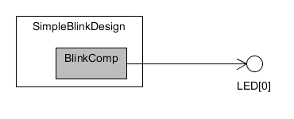
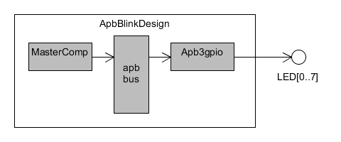

# Example Sparkfun Alchitry CU

## Introduction

The aim of this repository is to try to implement SpinalHDL designs from scratch as possible going from a very simple one (LED blinking) to a more complex one (SoC with VexRiscv processor).

## Compilation

- `make all`: translate spinalHDL to verilog, synthetize, place and route.

- `make time`: show timing critical path. 

- `make clean`: clean up compilation result.

## Simple Blink Design 

This design makes one board LED to blink with randomly choosen on / off time.

## Apb Blink Design 

In this design I start to use a APB bus to set the LEDs state.

## Hello World Design

In this design I connect an UART to the APB bus to send "Hello, world!" message.

## SRAM Design

In this design I integrate a BMB bus and a SRAM memory. A simple state machine 
will be used to send the memory content by the UART.

## License 

Refer to the [LICENSE](LICENSE) file.

## Useful Links

- [Schematic PDF](https://cdn.sparkfun.com/assets/2/6/e/5/e/alchitry_cu_sch_update.pdf)

- [APB Buss Specification PDF](https://web.eecs.umich.edu/~prabal/teaching/eecs373-f12/readings/ARM_AMBA3_APB.pdf)

- [Synthesis, placement and routing with IceStorm](http://www.clifford.at/icestorm/)

- [Alchitry Loader for Windows](https://github.com/alchitry/alchitry-loader-gui/blob/master/build/work/alchitry-loader-1.0.0-windows.zip)
